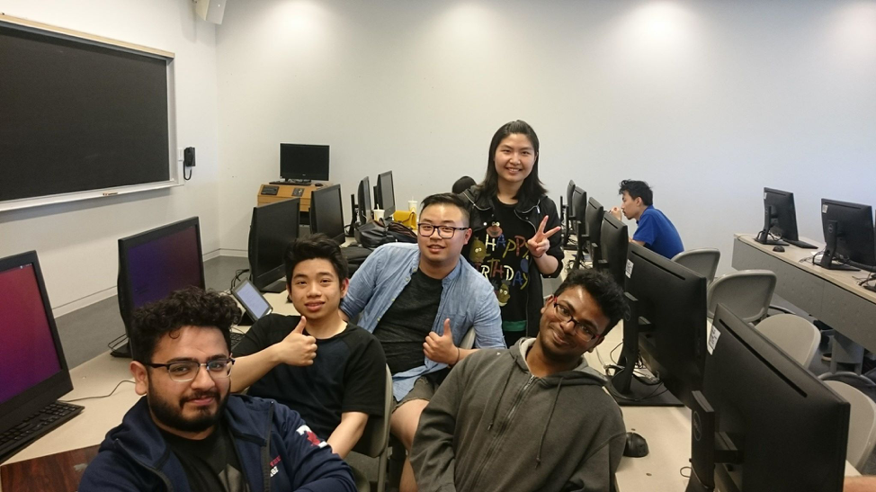

Our group consists of 5 members: Alan, Cindy, Kumar, Ali, and Wilson. We can be
seen in a group meeting in Figure 1 on the 4th floor of the IC building.
Majority of us met during our first tutorial (Tuesday 12-1 PM) aside from Cindy;
she joined as a 5th member via Alan. We have met once with the main purpose of
splitting up work, discussing front end choice, discussing how we want to
proceed with the project, and making sure everyone understands every aspect
about the project. This was an important meeting because prior to this meeting
little to nothing has been done and some members of the group did not understand
certain aspects of the assignments, more specifically user stories. Despite the
team only meeting up once, we talk regularly on Facebook messenger giving
updates about what has been done, how we can help one another etc. All our work
is done on a google drive that is shared with each member of the team. As a
collective team, we have decided that it would be simpler to do it this way
rather than using version control because no code has been written for phase 1.
We have also utilized the persona templates listed on blackboard as a guide for
writing our 3 different personas. Finally, we worked on user stories as a team
during our group meeting. The difficulty of each story was assigned similarly to
poker planning from agile methodologies. We would yell the difficulty at the
same time, and if different difficulties were yelled out, we would discuss why
we think it should be the difficulty we yelled out. Although our story
difficulties were done in a similar way to poker planning, we yelled
difficulties in terms of easy, medium, and hard rather than numbers.

Moving forward, the biggest lesson to take in is to increase the number of
meetings. It was evident that after our first meeting and everyone was
acclimated with the project, in terms of work the project started picking up
traction. The way our team meetings are organized must also change to follow an
agile approach where we will have daily stand up meetings stating what we’ve
accomplished and hope to accomplish by the end of day. Another lesson learned is
that we should plan in-person meetings earlier rather than later, so we aren’t
scrambling to finish work up; this will especially be more beneficial when
coding problems arises. It will be important to continue supporting one another
like we currently do, when others are overwhelmed with work from other courses
or does not fully understand the problem whether that be coding or concepts.
Finally, we need to utilize online group communication tools such as skype,
slack, or discord because Ali is from UTM, and is not always available for
in-person meetings.

 

Figure 1 Group meeting on the 4th floor of the IC building
